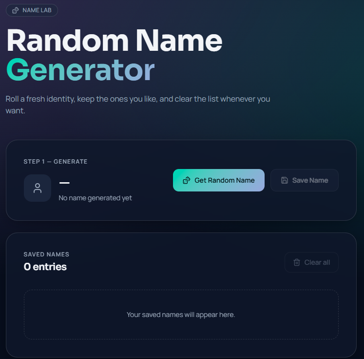

# 🎲 NameGen on EKS — DevOps Final Project

A Random Name Generator application deployed on **Amazon EKS**, demonstrating a full DevOps workflow: containerization, Infrastructure as Code, Kubernetes, and CI/CD.


This is a **DevOps project** — the focus is the infrastructure and deployment pipeline, not the application itself. The application (Node.js + Express + MongoDB) is based on [reselbob/random-name-gen-app](https://github.com/reselbob/random-name-gen-app).

🌐 **Live demo (while infra is up):** http://ad4624b8cda7f4d699dd80c7fd651736-4c969b263e9ab04f.elb.us-east-1.amazonaws.com/
> ⚠️ This URL is only valid while the Terraform-managed infrastructure exists. It is destroyed (and a new, different URL is generated on the next `terraform apply`) whenever `terraform destroy` is run — see [Cost Notes](#cost-notes). To get the current URL yourself: `kubectl get service namegen-service -n namegen`.



---

## Table of Contents

- [Architecture](#architecture)
- [Repository Structure](#repository-structure)
- [Prerequisites](#prerequisites)
- [Deployment](#deployment)
- [CI/CD](#cicd)
- [Cost Notes](#cost-notes)
- [Author](#author)
- [License](#license)

---

## Architecture

```
Developer
    │
    ▼
GitHub Repository
    │
    ▼
GitHub Actions Pipeline
    │
    ▼
Build & Push Docker Image (Docker Hub)
    │
    ▼
Amazon EKS Cluster
    │
    ├── Node.js Deployment ──┐
    │                        ▼
    │              MongoDB Service (headless)
    │                        │
    └── AWS Network          ▼
        Load Balancer   MongoDB StatefulSet
                              │
                              ▼
                    Persistent Volume (EBS)
```

**Components:**
| Component | Role |
|---|---|
| Node.js App | REST API + static UI, `Deployment` (stateless) |
| MongoDB | Data store, `StatefulSet` + `PersistentVolumeClaim` (EBS, never a `Deployment`) |
| Amazon EKS | Managed Kubernetes control plane + worker node |
| Terraform | Provisions all AWS infrastructure (VPC, IAM, EKS, EBS CSI driver) |
| Docker Hub | Container registry for the app image |
| AWS Network Load Balancer | Exposes the app to the internet |

More detail in [`skills/architecture.md`](skills/architecture.md).

---

## Repository Structure

```
/
├── app/                  # Node.js application source
├── Dockerfile
├── .dockerignore
├── terraform/            # AWS infrastructure (VPC, EKS, IAM, EBS CSI driver)
├── kubernetes/           # K8s manifests (namespace, StatefulSet, Deployment, Services)
├── skills/               # Project conventions & standards (Docker, K8s, Terraform, CI/CD, cost, debugging)
├── diagrams/             # Architecture & CI/CD diagrams (WIP)
├── screenshots/          # Deployment screenshots
└── .github/workflows/    # CI/CD pipeline (WIP)
```

---

## Prerequisites

- AWS account with configured credentials (`aws configure`)
- [Terraform](https://developer.hashicorp.com/terraform) >= 1.5
- [kubectl](https://kubernetes.io/docs/tasks/tools/)
- [Docker](https://www.docker.com/)
- A [Docker Hub](https://hub.docker.com) account

---

## Deployment

### 1. Provision the infrastructure

```bash
cd terraform
cp terraform.tfvars.example terraform.tfvars   # edit if needed
terraform init
terraform plan
terraform apply
```

This creates a VPC (public subnets only, no NAT Gateway), an EKS cluster, a single-node managed node group (`t3.small`), and the EBS CSI driver (required for MongoDB's persistent storage).

Connect `kubectl` to the new cluster:
```bash
aws eks update-kubeconfig --region us-east-1 --name namegen-eks
kubectl get nodes
```

### 2. Build and publish the Docker image

```bash
docker build -t <your-dockerhub-username>/namegen:v1 .
docker push <your-dockerhub-username>/namegen:v1
```

Update the image reference in [`kubernetes/deployment.yaml`](kubernetes/deployment.yaml) if your Docker Hub username differs.

### 3. Deploy to Kubernetes

```bash
kubectl apply -f kubernetes/
```

Verify everything is running:
```bash
kubectl get pods -n namegen
kubectl get pvc -n namegen
kubectl get service namegen-service -n namegen
```

Once `namegen-service` has an `EXTERNAL-IP` (a few minutes), open it in a browser.

---

## CI/CD

A GitHub Actions pipeline (`.github/workflows/deploy.yml`) is planned to automate: build → push image → deploy to EKS → verify rollout, on every push to `main`. *(In progress — not yet implemented.)*

---

## Cost Notes

This project prioritizes minimum AWS cost (see [`skills/aws_costs.md`](skills/aws_costs.md)):
- Single `t3.small` node, public subnets only (no NAT Gateway).
- EKS control plane (~$0.10/hr) and the NLB are **not free-tier** and bill for as long as they exist.

**When done working, tear down the infrastructure:**
```bash
cd terraform
terraform destroy
```

---

## Author

<div align="center">

**Roy Meoded**

Software Developer

[](https://github.com/roy3177)
[](https://www.linkedin.com/in/roy-meoded/)
[](mailto:roymeoded2512@gmail.com)

</div>

---

## License

Application code adapted from [reselbob/random-name-gen-app](https://github.com/reselbob/random-name-gen-app) (MIT License). Infrastructure and deployment configuration in this repository are original work for this project.

