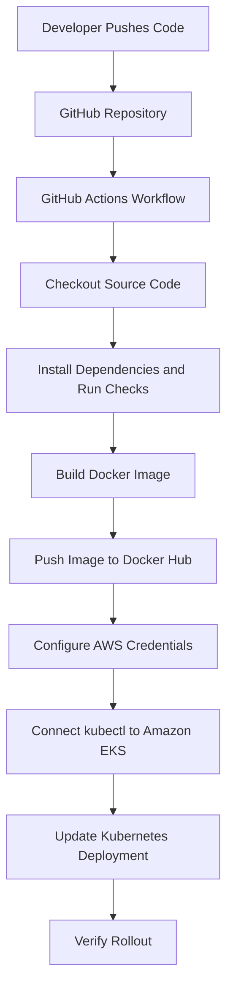

# GitHub Actions Skill

## Purpose

This document defines the GitHub Actions CI/CD standards for this project.

The workflow must automatically build and deploy the Random Name Generator application to Amazon EKS while remaining simple, secure, and cost-conscious.

GitHub Actions is the required CI/CD platform for this project.

---

# Pipeline Overview

The expected CI/CD flow is:



---

# Workflow Location

Store GitHub Actions workflows under:

```text
.github/workflows/
```

Recommended workflow file:

```text
.github/workflows/deploy.yml
```

Use descriptive workflow and job names.

---

# Workflow Triggers

The deployment workflow should run on:

- Pushes to the main branch
- Manual execution using `workflow_dispatch`

Recommended trigger:

```yaml
on:
  push:
    branches:
      - main
  workflow_dispatch:
```

Do not deploy automatically from every branch.

Pull requests may run validation steps, but they should not deploy to EKS.

---

# CI Responsibilities

The Continuous Integration stage should:

1. Check out the repository.
2. Set up the required Node.js version.
3. Install application dependencies.
4. Run available tests or validation commands.
5. Verify that the application can be built.
6. Build the Docker image.

Do not invent test commands that are not supported by the application.

If the source repository does not contain tests, document that limitation instead of pretending tests exist.

---

# Docker Image Build

Build the Docker image only after the initial validation steps succeed.

Use a unique and traceable image tag.

Preferred tags:

- Git commit SHA
- GitHub run number

Example:

```text
roymeoded/namegen:<commit-sha>
```

Avoid using only:

```text
latest
```

A stable tag such as `latest` may be added in addition to the immutable tag, but Kubernetes deployments should preferably use the immutable image tag.

---

# Container Registry

Use Docker Hub as the default container registry for this project because the main goal is to minimize AWS costs.

Required GitHub repository secrets may include:

```text
DOCKERHUB_USERNAME
DOCKERHUB_TOKEN
```

Never store Docker Hub credentials directly inside the workflow file.

Amazon ECR should only be introduced if it becomes an explicit project requirement.

---

# AWS Authentication

Never hardcode AWS credentials.

Prefer GitHub OpenID Connect with an IAM role when practical.

Possible configuration values:

```text
AWS_REGION
EKS_CLUSTER_NAME
AWS_ROLE_TO_ASSUME
```

When OpenID Connect is not yet configured, GitHub Secrets may temporarily contain AWS credentials for learning purposes, but this must be clearly documented and replaced with a safer method when possible.

Never commit:

```text
AWS_ACCESS_KEY_ID
AWS_SECRET_ACCESS_KEY
```

to the repository.

---

# EKS Deployment

After the Docker image has been pushed successfully, the workflow should:

1. Configure AWS authentication.
2. Update the local kubeconfig for the EKS cluster.
3. Apply the required Kubernetes manifests when needed.
4. Update the application Deployment to use the new image.
5. Wait for the rollout to complete.

Typical commands:

```bash
aws eks update-kubeconfig \
  --region "$AWS_REGION" \
  --name "$EKS_CLUSTER_NAME"

kubectl set image deployment/namegen-app \
  namegen-app="$DOCKERHUB_USERNAME/namegen:$IMAGE_TAG" \
  --namespace namegen

kubectl rollout status deployment/namegen-app \
  --namespace namegen \
  --timeout=180s
```

Resource names must match the actual Kubernetes manifests.

---

# Deployment Verification

A deployment is not considered successful only because `kubectl apply` completed.

The workflow must verify the rollout.

Recommended checks:

```bash
kubectl rollout status deployment/namegen-app --namespace namegen
kubectl get pods --namespace namegen
kubectl get services --namespace namegen
```

If rollout verification fails, the workflow must fail.

Do not hide deployment errors using commands such as:

```bash
command || true
```

---

# Kubernetes Manifest Strategy

Keep infrastructure manifests inside:

```text
kubernetes/
```

The GitHub Actions workflow may apply stable resources such as:

- Namespace
- Services
- MongoDB StatefulSet
- PersistentVolumeClaim
- Application Deployment

However, avoid recreating or unnecessarily changing stateful resources during every application deployment.

The normal application release should mainly update the Node.js application image.

---

# Secrets and Sensitive Values

Use GitHub Secrets for CI/CD credentials.

Use Kubernetes Secrets for application credentials.

Never print secrets in logs.

Avoid commands that reveal sensitive values.

Do not store the MongoDB password directly inside:

- The workflow file
- A public Kubernetes manifest
- The Docker image
- The source code

---

# Permissions

GitHub Actions permissions should follow the principle of least privilege.

Define explicit permissions when needed.

Example for OpenID Connect:

```yaml
permissions:
  contents: read
  id-token: write
```

Do not grant write permissions that the workflow does not require.

---

# Cost Rules

The workflow must not create a new EKS cluster on every push.

Terraform infrastructure creation and application deployment should remain separate operations.

The normal CI/CD pipeline should only:

- Build the image
- Push the image
- Deploy the application
- Verify the rollout

Avoid adding paid external CI/CD services when GitHub Actions is sufficient.

---

# Failure Handling

The workflow must stop when an important step fails.

Important failures include:

- Dependency installation failure
- Test or validation failure
- Docker build failure
- Docker push failure
- AWS authentication failure
- Kubernetes deployment failure
- Rollout timeout

Use clear step names so the failed stage is easy to identify.

---

# Workflow Design Rules

Always:

- Pin actions to stable major versions.
- Use readable environment variables.
- Keep credentials in GitHub Secrets.
- Use immutable Docker image tags.
- Verify Kubernetes rollout.
- Keep the workflow focused on the project requirements.
- Separate infrastructure provisioning from application deployment.

Avoid:

- Hardcoded credentials
- Hardcoded account-specific values
- Deploying from feature branches
- Rebuilding the image during the deployment stage
- Using only the `latest` tag
- Ignoring failed commands
- Creating AWS infrastructure on every push
- Adding unnecessary deployment environments

---

# Initial Project Scope

The first version of the pipeline should remain simple:

```text
Push to main
    ↓
Checkout
    ↓
Install and validate
    ↓
Build Docker image
    ↓
Push to Docker Hub
    ↓
Authenticate with AWS
    ↓
Update EKS deployment
    ↓
Verify rollout
```

Do not introduce the following unless explicitly required:

- Jenkins
- Argo CD
- GitLab CI
- Multiple deployment environments
- Complex approval workflows
- Automatic production rollback systems
- Paid security-scanning platforms

---

# Definition of Done

The GitHub Actions implementation is complete when:

- A push to `main` starts the workflow.
- The application validation succeeds.
- A Docker image is built.
- The image is pushed using a unique tag.
- The EKS Deployment uses the new image.
- Kubernetes rollout verification succeeds.
- No credentials are committed to Git.
- The workflow does not create unnecessary AWS resources.
- The process is documented in the README.